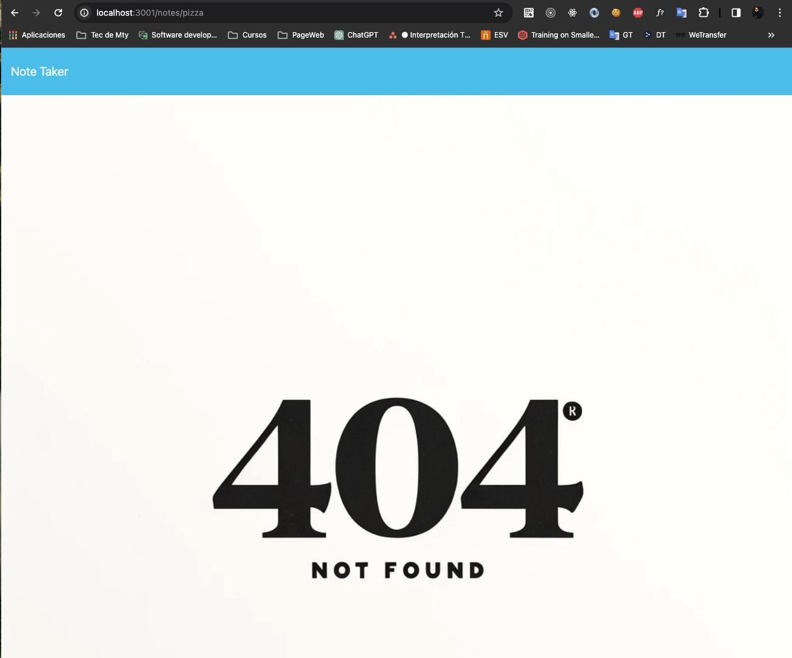

# Express.js Note Taker

This is a simple project of a note-taking application developed using Express.js. The application allows users to take notes, save them, and delete them as needed.

## Features

- Create new notes.
- View existing notes.
- Delete notes.
- Update note.
- Router 404 not fuont
- HEROKU

## Installation

Install the dependencies:

`npm install`

 ## Usage
To start the application, run the following command:

`npm start`

This will start the Express server, and you can access the application in your web browser at http://localhost:3001.

### License
This project is licensed under the [PonchoBT.Dev](LICENSE).

### Screenshots

### Demo

https://expressjsnotetaker2024-b36dca8ce42b.herokuapp.com/
